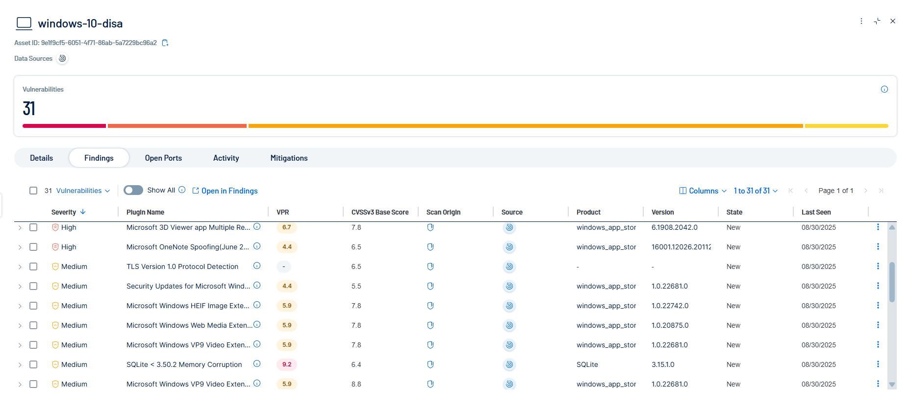
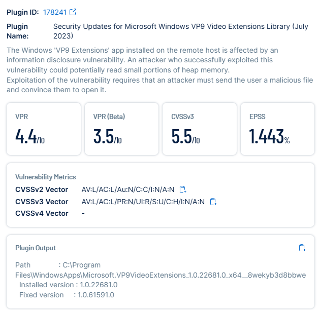

# STIG – Microsoft Windows VP9 Video Extensions Library (July 2023, Plugin ID: 178241)

## Before
- **Finding:** VP9 Video Extensions (v1.0.22681.0) was outdated and vulnerable to an information disclosure flaw.  
- **Risk:** Successful exploitation could allow attackers to read small portions of heap memory.  
- **Evidence:**  
    
    

---

## Remediation
1. Updated VP9 Video Extensions to version `1.0.61591.0` or later.  
2. Verified installation under `C:\Program Files\WindowsApps`.  
3. Rebooted system if required.  
4. Performed Tenable rescan to validate closure of the finding.  

---

## After
VP9 Video Extensions successfully updated to version 1.0.61591.0. Vulnerability remediated.

Evidence:
- VP9-After-Details.png  
- VP9-After-Rescan.png  
